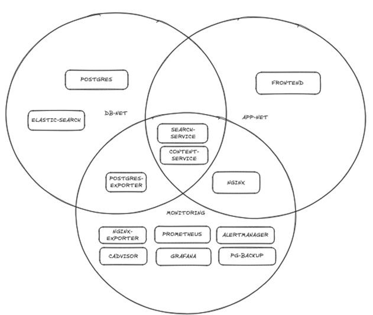
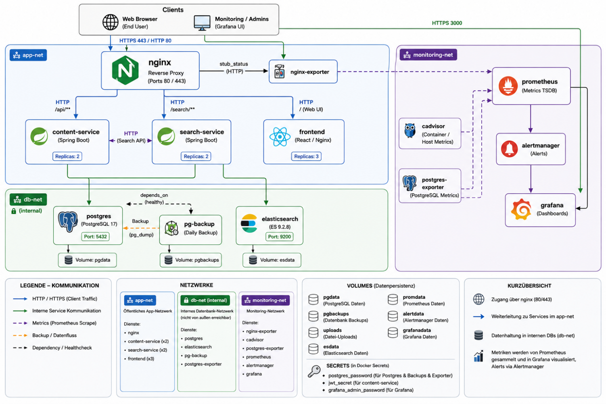

# Lego City Times — IT-Infrastruktur

Microservice-basiertes Online-Nachrichtenportal, vollständig containerisiert mit
`docker compose`. Enthält Anwendung (Frontend + 2 Backend-Services), Datenbank,
Volltextsuche, Reverse Proxy mit TLS und ein komplettes Monitoring-Stack
(Prometheus, Alertmanager, Grafana, Exporter).

---

## Inhalt

1. [Architektur](#1-architektur)
2. [Voraussetzungen](#2-voraussetzungen)
3. [Setup — Schritt für Schritt](#3-setup--schritt-für-schritt)
4. [URLs & Beispiel-Requests](#4-urls--beispiel-requests)
5. [Funktionen testen & nachvollziehen](#5-funktionen-testen--nachvollziehen)
6. [Stoppen / Cleanup](#6-stoppen--cleanup)
7. [Troubleshooting](#7-troubleshooting)

---

## 1. Architektur

| Service | Beschreibung | Interner Port | Host-Port |
|---|---|---|---|
| `nginx` | Reverse Proxy / **einziger Eingang**, TLS-Terminierung | 80 / 443 | **80, 443** |
| `frontend` | Next.js Web-UI (3 Replicas) | 3000 | – |
| `content-service` | Spring Boot REST API: Artikel, Bilder, Auth (2 Replicas) | 8080 | – |
| `search-service` | Spring Boot REST API: Volltextsuche (4 Replicas) | 8080 | – |
| `postgres` | Persistenz für Artikel/User | 5432 | – |
| `elasticsearch` | Suchindex | 9200 | – |
| `pg-backup` | Automatisiertes tägliches DB-Backup | – | – |
| `prometheus` | Metriken-Server + Alert-Regeln | 9090 | – |
| `alertmanager` | Alarmierung (Slack) | 9093 | – |
| `grafana` | Dashboards | 3000 | **3000** |
| `cadvisor` | Container-Metriken | – | – |
| `postgres-exporter` | DB-Metriken für Prometheus | – | – |
| `nginx-exporter` | Nginx-Metriken für Prometheus | – | – |

**Netz-Isolation (3 Bridge-Netze):**



*Bild 1 — Netz-Zugehörigkeit der Services. `content-service` und `search-service`
liegen in mehreren Netzen (Schnittmenge), damit sie sowohl Anfragen von `nginx`
(app-net) als auch Datenbank/Suche (db-net) und das Monitoring (monitoring-net)
erreichen.*



*Bild 2 — Vollständige Topologie: Datenflüsse, Ports/Protokolle, Volumes, Secrets
und Legende.*

Nur `nginx` (80/443) und `grafana` (3000) sind vom Host erreichbar. Datenbank,
Elasticsearch, Backend-Services, Prometheus und Alertmanager haben **keinen**
Host-Port. `db-net` ist als `internal` markiert (kein Internet-Zugang).

---

## 2. Voraussetzungen

- **Docker Desktop** (oder Docker Engine + Compose-Plugin), Compose v2
- **Mind. 8 GB freier RAM** (Elasticsearch reserviert allein 3–6 GB)
- Freie Host-Ports: `80`, `443`, `3000`
- Für die Lasttests: kein Extra-Tool nötig — `k6` wird per Docker-Image ausgeführt

Prüfen:

```powershell
docker --version
docker compose version
```

---

## 3. Setup — Schritt für Schritt

> Plattform: Befehle in **PowerShell** (Windows). Linux/macOS-Äquivalente stehen
> jeweils darunter.

### Schritt 1 — Secrets anlegen

Passwörter/Schlüssel werden als **Docker Secrets** aus `secrets/*.txt` eingebunden
(siehe `docker-compose.yml`, Abschnitt `secrets:`). Diese Dateien sind per
`.gitignore` vom Repo ausgeschlossen und müssen **einmalig lokal** erstellt werden.

> Falls die Dateien evtl. schon vorhanden sind — dann diesen Schritt überspringen
> (`Get-ChildItem secrets` zum Prüfen).

```powershell
New-Item -ItemType Directory -Force secrets | Out-Null
Set-Content -NoNewline secrets\postgres_password.txt "SuperSafeDbPass123"
Set-Content -NoNewline secrets\grafana_password.txt  "SuperSafeGrafana123"
# JWT-Secret: mind. 32 Zeichen
Set-Content -NoNewline secrets\jwt_secret.txt "change-me-this-is-a-very-long-jwt-secret-key-123456"
```

Linux/macOS:

```bash
mkdir -p secrets
printf 'SuperSafeDbPass123' > secrets/postgres_password.txt
printf 'SuperSafeGrafana123' > secrets/grafana_password.txt
printf 'change-me-this-is-a-very-long-jwt-secret-key-123456' > secrets/jwt_secret.txt
```

### Schritt 2 — `.env` anlegen

Wird nur für die Slack-Webhook-URL des Alertmanagers gebraucht (wird vor dem
Start in die Alertmanager-Config gerendert).

```powershell
Copy-Item .env.example .env
# Optional: SLACK_API_URL in .env auf einen echten Slack-Webhook setzen,
# sonst bleibt der Platzhalter — der Stack startet trotzdem.
```

### Schritt 3 — Stack starten (Build beim ersten Mal)

```powershell
.\scripts\up.ps1 -Build
```

Linux/macOS:

```bash
./scripts/up.sh --build
```

Das Start-Skript rendert zuerst `alertmanager.generated.yml` aus dem Template
(`SLACK_API_URL` aus `.env`) und startet dann `docker compose up -d --build`.

> **Alternativ ohne Skript** (Alertmanager-Config muss dann manuell gerendert sein):
> `docker compose up -d --build`

**Was beim ersten Start automatisch passiert** (keine manuellen Init-Schritte nötig):

- Images für `frontend`, `content-service`, `search-service` werden gebaut
- alle Volumes werden angelegt
- **DB-Tabellen** werden via JPA `ddl-auto=update` + `DataInitializer` erzeugt
- **Elasticsearch-Index/Mapping** wird von Spring Data Elasticsearch automatisch angelegt
- `depends_on: service_healthy` sorgt für die korrekte Startreihenfolge

### Schritt 4 — Hochlauf abwarten & Status prüfen

```powershell
docker compose ps
```

Elasticsearch + Java-Services brauchen 1–3 Minuten bis `healthy`. Erst wenn
`content-service`, `search-service` und `frontend` healthy sind, startet `nginx`.

Erreichbarkeit testen (Zertifikat ist selbst-signiert → `-k`):

```powershell
curl.exe -k https://localhost/actuator/health
```

Erwartet: `{"status":"UP", ...}`.

---

## 4. URLs & Beispiel-Requests

> nginx terminiert TLS mit selbst-signiertem Zertifikat. `http://localhost/` wird
> auf `https://localhost/` umgeleitet → Browser zeigt eine Zertifikatswarnung
> (akzeptieren). Für `curl` die Option `-k` nutzen.

| Zweck | URL |
|---|---|
| **Webanwendung (Frontend)** | https://localhost/ |
| **Daten verarbeitender Endpunkt** | `POST https://localhost/internal/search/articles/index` |
| **Health-Check** | https://localhost/actuator/health |
| Such-API | `GET https://localhost/api/v1/search/articles?q=...` |
| Artikel-API (Anlegen, ADMIN-Auth) | `POST https://localhost/api/v1/articles` |
| Swagger UI (Content) | https://localhost/swagger-ui/index.html |
| Grafana | http://localhost:3000 (`admin` / Inhalt aus `secrets/grafana_password.txt`) |

### Daten senden (Index-Endpunkt, keine Auth nötig)

```powershell
curl.exe -k -X POST https://localhost/internal/search/articles/index `
  -H "Content-Type: application/json" `
  -d '{\"id\":\"demo-1\",\"title\":\"Neues Stadion in Lego City\",\"slug\":\"neues-stadion\",\"content\":\"In Lego City wurde heute...\",\"author\":\"Redaktion\",\"status\":\"PUBLISHED\",\"publishedAt\":\"2026-05-22T00:00:00Z\"}'
```

### Suchen

```powershell
curl.exe -k "https://localhost/api/v1/search/articles?q=stadion"
```

API-Übersicht: Artikel (`/api/v1/articles`), Suche (`/api/v1/search/articles`),
Kategorien/Tags/Bilder (`/api/v1/categories|tags|images`),
Auth (`/api/v1/auth/register|login`).

---

## 5. Funktionen testen & nachvollziehen

Dieser Abschnitt zeigt für jede Eigenschaft der Infrastruktur den konkreten
Befehl, mit dem sie sich live nachvollziehen lässt — vom Start über Persistenz
und Last bis zu Verfügbarkeit, Monitoring und Sicherheit.

### 5.1 Start via `docker-compose` & automatische Initialisierung

```powershell
# Stack ist gestartet (Schritt 3). Alle Services healthy?
docker compose ps

# Tabellen wurden automatisch angelegt:
docker exec legocitytimes-postgres psql -U legocity -d legocitytimes -c "\dt"

# Elasticsearch-Index wurde automatisch angelegt:
docker exec legocitytimes-elasticsearch curl -fs http://localhost:9200/_cat/indices?v
```

| Funktion | Nachweis |
|---|---|
| Init automatisch | `\dt` listet Tabellen, `_cat/indices` zeigt Article-Index — ohne manuelle Schritte |
| Webanwendung über URL | https://localhost/ im Browser |
| Daten-Endpunkt | `POST /internal/search/articles/index` (Beispiel oben) |
| Health-URL | https://localhost/actuator/health |

### 5.2 Persistente Daten in Volumes

```powershell
# Volumes existieren:
docker volume ls | Select-String legocitytimes

# Persistenz-Test: Daten anlegen → Stack neu starten → Daten noch da
curl.exe -k -X POST https://localhost/internal/search/articles/index -H "Content-Type: application/json" -d '{\"id\":\"persist-1\",\"title\":\"Persistenz-Test\",\"slug\":\"persist\",\"content\":\"x\",\"author\":\"A\",\"status\":\"PUBLISHED\",\"publishedAt\":\"2026-05-22T00:00:00Z\"}'
docker compose down      # Volumes bleiben erhalten!
.\scripts\up.ps1         # ohne -Build
curl.exe -k "https://localhost/api/v1/search/articles?q=Persistenz"   # Treffer → persistent
```

Persistente Volumes: `legocitytimes-pgdata`, `-esdata`, `-uploads`, `-promdata`,
`-alertdata`, `-grafanadata`, `-pgbackups`.

### 5.3 Lasttests (k6)

Skripte: `load-tests/k6/`. Dokumentierte Ergebnisse: `load-tests/results/README.md`
(+ `*.log` Rohdaten).

**Empfohlen (stabil für 1000 VU): k6 im selben Docker-Netz gegen `https://nginx`** —
umgeht den Docker-Desktop-Host-Port-Proxy:

```powershell
docker run --rm --network legocitytimes-app-net -v "${PWD}:/work" -w /work `
  -e K6_INSECURE_SKIP_TLS_VERIFY=true `
  -e WEB_BASE_URL=https://nginx -e DATA_BASE_URL=https://nginx `
  grafana/k6 run load-tests/k6/web_page_parallel_10_0s.js
```

**Web-Endpunkt (Seite anzeigen)** — alle dokumentiert als PASS, 0,00 % Fehler:

| Szenario | Skript |
|---|---|
| 10 parallel, 0s | `web_page_parallel_10_0s.js` |

### 5.4 WAF (ModSecurity) testen

Der Reverse Proxy (`nginx`) nutzt ModSecurity mit OWASP CRS. Der Test sendet
harmlos-formatierte Requests, die typischerweise mit **403** geblockt werden.

```powershell
.\scripts\waf-tests.ps1
```

Erwartung:

- Jeder Test liefert `HTTP 403`
- Die nginx-Logs enthalten ModSecurity-Eintraege (Rule IDs, z. B. 941100/942100)

Nur Logs anzeigen (ohne Requests):

```powershell
.\scripts\waf-tests.ps1 -LogsOnly
```
| 100 parallel, 1s | `web_page_parallel_100_1s.js` |
| 1000 parallel, 5s | `web_page_parallel_1000_5s.js` |
| 1000 parallel, 1s | `web_page_parallel_1000_1s.js` |
| 1000 req/min, 10 min | `web_page_rate_1000rpm_10m.js` |

**Daten-Endpunkt (Indexing)** — für 5MB-Szenarien zuerst Payload erzeugen:

```powershell
powershell -ExecutionPolicy Bypass -File load-tests/k6/generate-payloads.ps1
```

| Szenario | Skript | Dok. Ergebnis |
|---|---|---|
| 10 parallel, normal | `data_index_parallel_10_0s_small.js` | PASS |
| 100 parallel, normal | `data_index_parallel_100_1s_small.js` | PASS |
| 1000 parallel, normal | `data_index_parallel_1000_5s_small.js` | PASS |
| 10 parallel, 5MB | `data_index_parallel_10_0s_5mb.js` | PASS |
| 100 parallel, 5MB | `data_index_parallel_100_1s_5mb.js` | PASS |
| 1000 parallel, 5MB, 429 erlaubt | `data_index_parallel_1000_5s_5mb_allow429.js` | PASS |
| 1000 parallel, 5MB, strict | `data_index_parallel_1000_5s_5mb_strict.js` | offen |

Beispiel (ein Skript ausführen — Dateiname am Ende austauschen):

```powershell
docker run --rm --network legocitytimes-app-net -v "${PWD}:/work" -w /work `
  -e K6_INSECURE_SKIP_TLS_VERIFY=true -e DATA_BASE_URL=https://nginx `
  grafana/k6 run load-tests/k6/data_index_parallel_100_1s_small.js
```

Details & Defaults: `load-tests/k6/README.md`.

### 5.4 Verfügbarkeit

```powershell
# Frontend hat 3 Replicas — eine killen, Seite bleibt erreichbar:
docker ps --filter "name=frontend" --format "{{.Names}}"
docker kill <ein-frontend-container>
curl.exe -k -o NUL -w "%{http_code}`n" https://localhost/    # weiterhin 200
# (Compose startet den Container per restart-policy automatisch neu)

# Backend-Ausfall wird im Monitoring sichtbar — content-service stoppen:
docker compose stop content-service
#   → Grafana/Prometheus: Alert "ServiceDown" feuert
#   → Frontend zeigt Fehlerbanner ("Server nicht erreichbar")
docker compose start content-service

# Datenbank-Ausfall wird im Monitoring sichtbar:
docker compose stop postgres
#   → Alert "PostgreSqlDown" (postgres-exporter)
#   → Frontend meldet "möglicherweise ist die Datenbank nicht erreichbar"
docker compose start postgres
```

Alert-Status live ansehen (in Grafana → Datasource Prometheus, oder kurz exponieren):

```powershell
docker exec legocitytimes-prometheus wget -qO- "http://localhost:9090/api/v1/alerts"
```

| Verhalten | Status |
|---|---|
| Frontend-Ausfall ohne Impact | ✅ `replicas: 3` + nginx `least_conn` |
| Backend-Ausfall im Monitoring | ✅ Alert `ServiceDown` |
| Frontend-Fehlermeldung bei Backend-Ausfall | ✅ `ErrorBanner` |
| DB-Ausfall im Monitoring | ✅ Alert `PostgreSqlDown` |
| Frontend-Fehlermeldung bei DB-Ausfall | ✅ |
| Auto-Scale-Out bei Überlast | ⚠️ statisch (mehrere Replicas), keine Autoskalierung |

### 5.5 Monitoring

```powershell
# Health-Checks aller Services:
docker compose ps      # Spalte STATUS zeigt (healthy)

# Prometheus scrapt alle Targets (alle "up"):
docker exec legocitytimes-prometheus wget -qO- "http://localhost:9090/api/v1/targets" | Select-String '"health":"up"'

# Container-Absturz → Erkennung + Auto-Restart (restart: unless-stopped):
docker kill legocitytimes-content-service-1   # Name ggf. anpassen
docker compose ps                              # Container kommt automatisch zurück

# Ressourcen-Limits gesetzt:
docker inspect legocitytimes-postgres --format "{{.HostConfig.Memory}} bytes / {{.HostConfig.NanoCpus}} nanocpu"
```

- **Grafana** (http://localhost:3000): vorkonfiguriertes Dashboard „Lego City Times"
  (CPU/Memory pro Container, HTTP-Raten, p95-Latenz, DB-Verbindungen).
- **Alert-Regeln**: `monitoring/prometheus/alert_rules.yml` (CPU, Memory, 5xx,
  Latenz, Service-/Replica-/Container-Ausfall, DB-Verbindungen).
- **Benachrichtigung**: Alertmanager → Slack (`SLACK_API_URL` aus `.env`).

### 5.6 Security

```powershell
# Netz-Isolation (3 Netze, db-net internal):
docker network ls | Select-String legocitytimes
docker network inspect legocitytimes-db-net --format "internal={{.Internal}}"   # true

# TLS aktiv (selbst-signiert):
curl.exe -kv https://localhost/ 2>&1 | Select-String "SSL connection|subject"

# Secrets NICHT in docker inspect sichtbar (kein Klartext-Passwort):
docker inspect legocitytimes-postgres | Select-String -Pattern "PASSWORD" -CaseSensitive:$false
#   → nur POSTGRES_PASSWORD_FILE=/run/secrets/... , kein Klartext

# Keine unnötigen Host-Ports (nur 80/443/3000):
docker compose ps --format "table {{.Name}}\t{{.Ports}}"

# Hardening (read_only, cap_drop, no-new-privileges):
docker inspect legocitytimes-nginx --format "ReadOnly={{.HostConfig.ReadonlyRootfs}} CapDrop={{.HostConfig.CapDrop}}"
```

| Maßnahme | Umsetzung |
|---|---|
| Netz-Isolation | `app-net`, internes `db-net`, `monitoring-net` |
| SSL | nginx TLS auf 443, Zert. in `monitoring/nginx/certs` |
| WAF | ModSecurity v3 + OWASP CRS im nginx, Modus `On` (blockierend, siehe `docs/waf.md`) |
| Secrets | Docker Secrets (Postgres, Grafana, JWT) + `.env` für Slack |
| Keine unnötigen Ports | nur 80, 443, 3000 |
| Zusatz-Hardening | `tmpfs`, `cap_drop`, gezielte `cap_add`, `no-new-privileges` |

### 5.7 Sicherheitsscan & Backup

**Sicherheitsscan (Trivy):**

```powershell
.\scripts\security-scan.ps1
```

Dokumentation: `docs/security-scan.md` (Ergebnis: **0 Critical** über alle eigenen
Images). Reports: `docs/security-scans/*.txt`.

**Automatisiertes DB-Backup:**

```powershell
# Backups vorhanden:
docker exec legocitytimes-pg-backup ls -lh /backups/daily /backups/last
# Manuell auslösen (ohne auf Cron zu warten):
docker exec legocitytimes-pg-backup /backup.sh
```

Service `pg-backup` (`@daily`), Volume `legocitytimes-pgbackups`. Doku: `docs/db-backup.md`.

| Aspekt | Status |
|---|---|
| WAF | ✅ ModSecurity v3 + OWASP CRS im nginx, Modus `DetectionOnly` (`docs/waf.md`) |
| Sicherheitsscan durchgeführt & dokumentiert | ✅ `docs/security-scan.md` |
| Keine kritischen Schwachstellen | ✅ 0 Critical |
| Automatisiertes DB-Backup | ✅ `pg-backup` |

---

## 6. Stoppen / Cleanup

```powershell
docker compose down        # stoppen — Volumes (persistente Daten) bleiben erhalten
docker compose down -v     # alles entfernen inkl. persistenter Daten
```

---

## 7. Troubleshooting

| Problem | Lösung |
|---|---|
| `nginx` startet nicht | Wartet auf `content/search/frontend = healthy`. `docker compose ps` prüfen, ggf. 1–3 min warten. |
| Elasticsearch crasht / OOM | Docker Desktop mind. 8 GB RAM zuweisen. |
| Alertmanager startet nicht | `.env` fehlt oder `SLACK_API_URL` nicht gesetzt → `.\scripts\render-alertmanager.ps1` neu ausführen. |
| `secrets/... not found` beim Start | Schritt 1 (Secrets anlegen) wurde übersprungen. |
| Lasttest gegen `localhost` fehlerhaft bei 1000 VU | k6 im `app-net` gegen `https://nginx` laufen lassen (siehe 5.3). |
| Browser warnt vor Zertifikat | Erwartet (selbst-signiert) — akzeptieren bzw. `curl -k`. |
